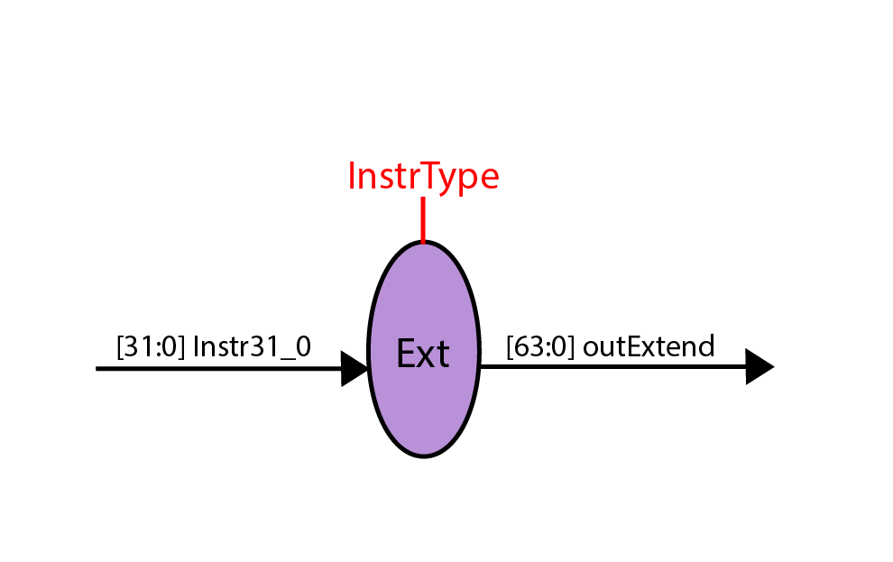

# riscv
Processador Risc-V Multiciclo

**Unidade de
processamento**{width="6.1662423447069115in"
height="3.4625in"}

**Descrição dos Módulos**

**SignalExtend**

Algumas instruções possuem um elemento chamado de imediato que, na
maioria dos casos, encontra-se fora de ordem. Em uma tabela abaixo, é
possível ver onde se encontra o imediato de cada tipo de instrução.

Antes de usá-lo, o sinal do imediato precisa ser estendido. Dessa forma,
surge a necessidade de um módulo que receba a instrução inteira e um
sinal indicando qual o tipo da instrução. O sinal em questão é o
InstrType, possui três bits e é setado na unidade de controle, logo após
a comparação do opcode. Portanto, para cada tipo de instrução, existe um
InstrType diferente.

O módulo SignalExtend primeiramente monta o imediato de cada instrução:
immI, immS, immSB, immUJ, immU guardam, respectivamente, os immediatos
das instruções do tipo I, S, SB, UJ e U.

**Tipo I** - \[31:20\] (tamanho: \[11:0\]) (immI)

  31   30   29   28   27   26   25   24   23   22   21   20   19   18   17   16   15
  ---- ---- ---- ---- ---- ---- ---- ---- ---- ---- ---- ---- ---- ---- ---- ---- ----
  11   10   9    8    7    6    5    4    3    2    1    0                        

  14   13   12   11   10   9   8   7   6   5   4   3   2   1   0
  ---- ---- ---- ---- ---- --- --- --- --- --- --- --- --- --- ---
                                                               

**Tipo S** - \[31:25,11:7\] (tamanho: \[11:0\]) (nome: immS)

  31   30   29   28   27   26   25   24   23   22   21   20   19   18   17   16   15
  ---- ---- ---- ---- ---- ---- ---- ---- ---- ---- ---- ---- ---- ---- ---- ---- ----
  11   10   9    8    7    6    5                                                 

  14   13   12   11   10   9   8   7   6   5   4   3   2   1   0
  ---- ---- ---- ---- ---- --- --- --- --- --- --- --- --- --- ---
                 4    3    2   1   0                           

**Tipo SB** - \[31,7,30:25,11:8\] (tamanho: \[11:0\]) (nome: immSB)

  31   30   29   28   27   26   25   24   23   22   21   20   19   18   17   16   15
  ---- ---- ---- ---- ---- ---- ---- ---- ---- ---- ---- ---- ---- ---- ---- ---- ----
  12   10   9    8    7    6    5                                                 

  14   13   12   11   10   9   8   7    6   5   4   3   2   1   0
  ---- ---- ---- ---- ---- --- --- ---- --- --- --- --- --- --- ---
                 4    3    2   1   11                           

**Tipo UJ** - \[31,19:12,20,30:21\] (tamanho: \[20:0\]) (nome: immUJ)

  31   30   29   28   27   26   25   24   23   22   21   20   19   18   17   16   15
  ---- ---- ---- ---- ---- ---- ---- ---- ---- ---- ---- ---- ---- ---- ---- ---- ----
  20   10   9    8    7    6    5    4    3    2    1    11   19   18   17   16   15

  14   13   12   11   10   9   8   7   6   5   4   3   2   1   0
  ---- ---- ---- ---- ---- --- --- --- --- --- --- --- --- --- ---
  14   13   12                                                 

**Tipo U** - \[31:12\] (tamanho: \[20:0\]) (nome: immU)

  31   30   29   28   27   26   25   24   23   22   21   20   19   18   17   16   15
  ---- ---- ---- ---- ---- ---- ---- ---- ---- ---- ---- ---- ---- ---- ---- ---- ----
  31   30   29   28   27   26   25   24   23   22   21   20   19   18   17   16   15

  14   13   12   11   10   9   8   7   6   5   4   3   2   1   0
  ---- ---- ---- ---- ---- --- --- --- --- --- --- --- --- --- ---
  14   13   12                                                 

Após montado, é feita a consulta a InstrType e a saída desse immediato
estendido é determinada levando em conta o seu sinal. Caso seja
negativo, a estenção é feita com vários bits 1 a esquerda do imediato e,
caso positivo, com vários bits 0 a esquerda do imediato. Para as
instruções do tipo SB e UJ, além da estenção do sinal, recebem dois bits
0 a direita. Um deles completa seu imediato que vai até 1 e não até 0,
como os outros tipos de instruções. O outro trata a necessidade de
multiplicar esse imediato por 2.

SignalExtend recebe duas entradas de 1 bit que são o clock e o reset,
recebe a instrução de 32 bits que vem do registrador de instruções,
InstrType, o identificador do tipo da instrução de 3 bits e retorna um
dado de 64 bits com o imediato extendido.

{width="4.193160542432196in" height="2.64375in"}

**ExtendToI**

A instrução ld usa o rs1 e imm extendido para calcular um endereço de
memória e armazena no rd o conteúdo inteiro da memória de dados que
encontra-se nesse endereço calculado. De forma parecida, a instrução sd
usa o rs1 e imm extendido para calcular um endereço de memória e
substitui o conteúdo que está nesse endereço da memória de dados, pelo
conteúdo inteiro de rs2.

Diferente dessas duas instruções, algumas precisam armazenar apenas uma
parte do rs2, preservando o restante contido na memória, ou armazenar em
rd não o conteúdo inteiro da memória naquele endereço específico, mas só
parte desse conteúdo. Portanto, surge a necessidade de um módulo que
faça o tratamento dessas variações de sd e ld, carregando ou escrevendo
o conteúdo correto nas partes certas.

ExtendToI recebe duas entradas de 1 bit que são o clock e o reset e
recebe um seletor de 3 bits, InstrIType, informando a instrução exata a
ser tratada. Entram, ainda, 4 dados de 64 bits cada. Um deles, outMDR, é
a saída da memória de dados após passar pelo registrador MDR.
Economizando um ciclo, esse dado vem também pela entrada DataMemOut. O
módulo recebe também a saída dos registradores A e B, regAOut e regBOut.
Como saídas, extendToBanco vai em direção ao banco de registradores e
extendToMem, à memória de dados.

**Muxes**{width="2.310416666666667in"
height="1.8328444881889763in"}

Foi criado um mux de 8 entradas e uma saída, ambas de 64 bits. Porém, a
partir desse, foram criados outros dois para dados de 32 bits e 5 bits.
Ambos, além das entradas e saída, recebem um seletor de 3 bits. Apesar
das 8 entradas, foram necessárias no máximo 4.

**extendToPC**

Para o caso de exceções de opcode ou overflow, surge a necessidade de
estender o valor de 32 bits saído da memória de instruções para o
registrador PC que é de 64 bits.{width="3.78125in"
height="0.32033792650918635in"}

ExtendToPC recebe duas entradas de um bit que são o clock e o reset,
além da saída de 32 bits vinda da memória de instruções e retorna um
dado de 64 bits, outExtendToPC que segue em direção a PC.

**Descrição dos Estados**

A unidade de controle possui cerca de 52 estados. No entanto, alguns
desses, atuam apenas apenas como bypass para outros estados, como boa
parte dos stores e loads que aproveitam as ações de sd e ld. Há também
uma grande recorrência do ato de salvar no rd e, portanto, existe um
estado dedicado somente a esta ação. Para os branches, como a ação que
ocorre em caso de desvio é a mesma para todos, eles acabam por partilhar
um mesmo estado.

**Estados Iniciais**

**busca**

Libera a escrita em PC para que seja possível incrementá-lo, prepara a
ALU para a soma e seleciona PC através do seletor do Mux1 e 4 no Mux2.

**salvaInstrucao**

Ativa a escrita no registrador de instruções para salvar a instrução
vinda da memória de instruções.

**decodInstrucao**

Verifica o opcode e funcs para determinar qual o estado a tratar cada
instrução além de identificar cada uma delas alterando o valor de
InstrType e InstrIType. Além disso, libera a leitura do banco de
registradores por meio do seu seletor e carrega o rs1 e rs2
respectivamente nos registradores A e B.

**Estados de Instruções**

**add**

Soma rs1 com rs2 e salva o resultado dessa soma em rd. Para isso,
seleciona a saída dos muxes referentes às entradas dos registradores A e
B, ativa a soma na Alu e libera a escrita no registrador da Alu. Caso
não ocorra overflow, após isso, vai para loadRd, onde a saída da alu
será carregada no rd. Em caso de overflow, vai tratar a exceção de
overflow em outro estado.

**sub**

Realiza subtração entre rs1 e rs2. Após isso, salva o resultado dessa
subtração em rd. Para isso, seleciona a saída dos muxes referentes às
entradas dos registradores A e B, ativa a subtração na Alu e libera a
escrita no seu registrador. Caso não ocorra overflow, após isso, vai
para loadRd, onde a saída da alu será carregada no rd. Em caso de
overflow, vai tratar a exceção de overflow em outro estado.

**loadRD**

Através do seletor do mux, escolhe a saída da ALU, garante que o
endereço de rd será Instr11\_7 e libera a escrita no banco de
registradores, ou melhor, em rd.

**addi**

Soma o valor do registrador rs1 com a constante imm e salva no
registrador de destino, rd. Para isso, seleciona as saídas dos muxes
referentes a rs1 e o imediato extendido para a alu. Ativa a soma na alu
e libera a escrita em seu registrador. Caso não ocorra overflow, após
isso, vai para loadRd, onde a saída da alu será carregada no rd. Em caso
de overflow, vai tratar a exceção de overflow em outro estado.

**lb**

Como ExTendToI já possui seu imediato tratado, vai para o primeiro
estado de ld.

**lh**

Como ExTendToI já possui seu imediato tratado, vai para o primeiro
estado de ld.

**lw**

Como ExTendToI já possui seu imediato tratado, vai para o primeiro
estado de ld.

**lbu**

Como ExTendToI já possui seu imediato tratado, vai para o primeiro
estado de ld.

**lhu**

Como ExTendToI já possui seu imediato tratado, vai para o primeiro
estado de ld.

**lwu**

Como ExTendToI já possui seu imediato tratado, vai para o primeiro
estado de ld.

**ld\_estado1**

O ld lê uma Double Word (64 bits) da memória de dados e escreve no
registrador de destino. Soma o que está em rs1 com o imediato para obter
o endereço a ser buscado na memória. O que estiver nesse endereço, será
salvo em rd. No seu primeiro estado, libera rs1 e o imediato estendido
para ALu através dos muxes 1 e 2, ativa a soma na alu e libera a escrita
em seu registrador. Após isso, segue para a segunda fase do ld.

**ld\_estado2**

Através do seletor da memória de dados, lê o conteúdo da memória no
endereço saído da alu e segue pra terceira fase do ld.

**ld\_estado3**

Libera a escrita no registrador MDR e segue para a quarta fase de ld.

**ld\_estado4**

Seleciona a saída da memória em direção ao banco, garante que ser
escrito é o Instr11\_7 e libera a escrita no banco, ou melhor, em rd.

**Conclusão**

Ao final do projeto podemos perceber a importância de cada módulo para a
execução de cada estado para cada instrução de um processador Risc V e
pudemos entender melhor o funcionamento de um processador e o quão é
interessante saber a respeito do seu conjunto de instruções. Os
objetivos dispostos foram efetivados, sendo notado a realização do
projeto e do relatório de forma satisfatória, apesar de algumas
dificuldades iniciais na execução dos mesmos, conseguimos superar e
entregamos o projeto com sucesso.
